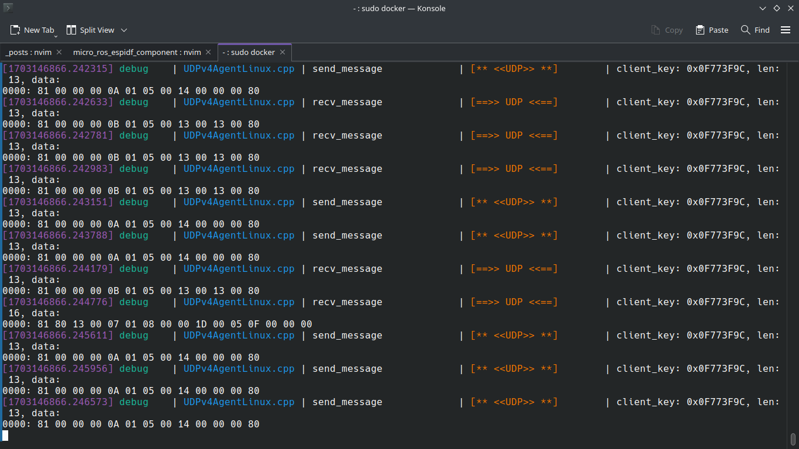

---
---
layout: post
title: TIL (21/12/23) 
---
## Reproducability

- From this [blog](http://developmentalsystems.org/how_many_random_seeds), I got aware of this **reproducibility issue** in RL i.e execution of same alogrithm in same enironment gives different results each time. It might be due different initial conditions, seeds etc for e.g. issues faced when [reproducing a deep RL paper](http://amid.fish/reproducing-deep-rl) by Matthew Rahtz.

- For which the author proposes some *statistical tests* and he has a written a paper about [this](https://arxiv.org/abs/1806.08295).

May be I have to have a look on it later.

- ACL has been already implemented by these [guys](https://github.com/flowersteam/TeachMyAgent).

- Some Eng resources I got,
    1. [Nuts and Bolts of Deep RL Experimentation by John Schulman](https://youtu.be/8EcdaCk9KaQ)
    2. Notes by [Falcon](https://github.com/williamFalcon/DeepRLHacks)

## micro-ROS

Today I did a hello world in micro-ROS. micro-ROS is used for interfacing ROS with resource constrained embedded devices. I had bought an ESP32-WROOM board since micro-ROS supports ESP, I thought of trying it and followed this [post](https://robofoundry.medium.com/esp32-micro-ros-actually-working-over-wifi-and-udp-transport-519a8ad52f65). In which I did,

   - I had compiled the int32_publisher example using `idf.py`(provided by ESP) and flashed it to my ESP board.

   - Then ran a micro-ROS agent(docker container) on my laptop and which recieved messages from ESP.

Basically we have to write a C code using ESP,micro-ROS and RTOS(FreeRTOS) libraries which then can be compiled & flashed into ESP and then it works accordingly. I had this [issue](https://github.com/micro-ROS/micro_ros_espidf_component/issues/217) with specifying the port for the agent.

Have to go through the `rclc` [API](https://micro.ros.org/docs/tutorials/programming_rcl_rclc/node/).

I am gonna work on some project like with FreeRTOS & micro-ROS ?

layout: post
title: TIL (22/12/23) 
---

I was thinking about what I can do next with ESP32 and micro-ROS and so I thought to learn RTOS first as it is also used and then dwelve into microROS.

For learning RTOS(gonna a start with FreeRTOS itself), I came across this [tutorial](https://youtube.com/playlist?list=PLEBQazB0HUyQ4hAPU1cJED6t3DU0h34bz&si=kcy_3-PGuwPFo41r) which looks good.

Then I learned about Policy Gradient methods to solve MDPs from Deep RL course I'm doing from HF. Really the math is little involved which I have to dwelve step by step. While going across Policy Gradient Theorem derivation, I came across few tricks and assumptions used, for e.g. 

   - Reinforce Trick: $\frac{\nabla_{\theta}P(\tau)}{P(\tau)} = \nabla_{\theta}\\log(P(\tau))$

   - State Distribution is independent of parameters($\theta$) of policy (I think this implies that the choice of action from action distribution given by the policy isn't covered by the policy i.e its not a part of policy I guess).

   - Sampling m trajectories from the trajectory($\tau$) distribution

Next I have too do the hands-on and refer more about it.

## RTOS

- We can use RTOS when we have to run many **tasks concurrently** or if it's time demanding, which can't be done in general **Super loop** configurations(I mean the usual setup and loop parts).

- ESP32 uses a modified version of FreeRTOS which supports its SMP (Symmetric MultiProcessing) architecture to schedule tasks by using [both cores](https://docs.espressif.com/projects/esp-idf/en/latest/esp32/api-reference/system/freertos_idf.html)! (but this tutorials is only for multi-tasking in single core)

### Task Scheduling 

- [**Context Switching**]() : How are tasks are switched from one to another.

- Task pre-emption

